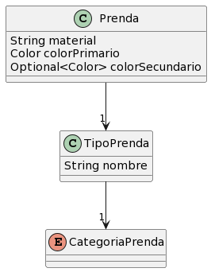

# QMP

## 1. Requerimientos

- Poder **cargar** prendas
- Poder **saber** la categoria de una prenda
(las categorias son: superior, inferior, calzado, accesorio)
- Poder asignarle un tipo a una prenda (Obligatorio)
- Poder asignarle un material a una prenda (Obligatorio)
- Poder asignarle un color principal a una prenda (Obligatorio)
- Poder asignarle un color secundario a una prenda (Optativo)
- Un tipo de prenda debe relacionarse con una sola categoria

## 2. Solucion

	
## Comentarios

Quizas estoy sobreinterpretando el enunciado, pero cuando el cliente
hace mencion de los tipos de prenda, utiliza "etc" dando a entender que
la lista de tipos puede y va a extenderse.

Por lo tanto, a diferencia de las categorias que solo son un conjunto finito,
los tipos no pueden quedar como un enum "hardcodeado".
Sería una solucion poco escalable, ya que cada nuevo tipo de prenda que se
presente al sistema tendría que verse reflejado como un nuevo campo de un enum

El usuario tendrá que especificar los tipos a medida que los incorpore,
tal y como lo hará con las prendas.

## 3. Comentarios de alternativas descartadas

- Originalmente había idealizado los tipos de prenda como un enum.